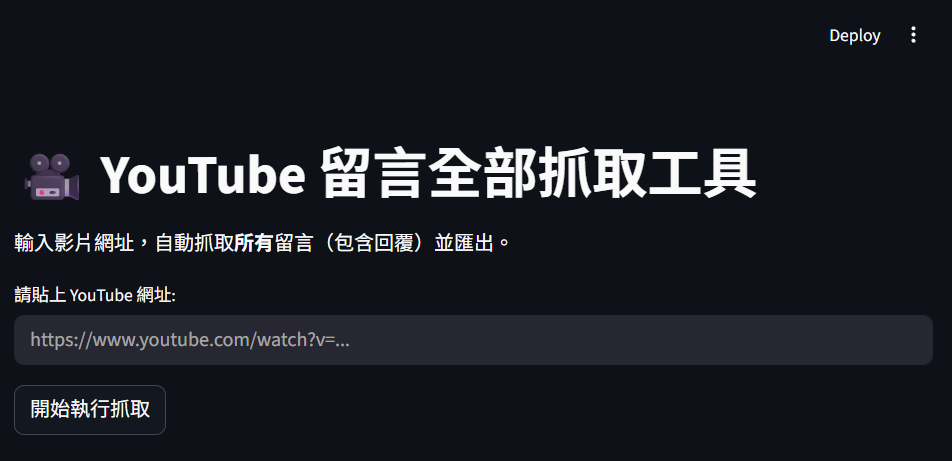
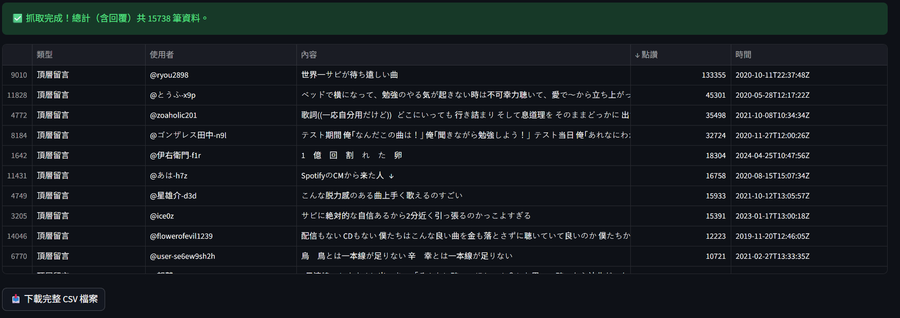
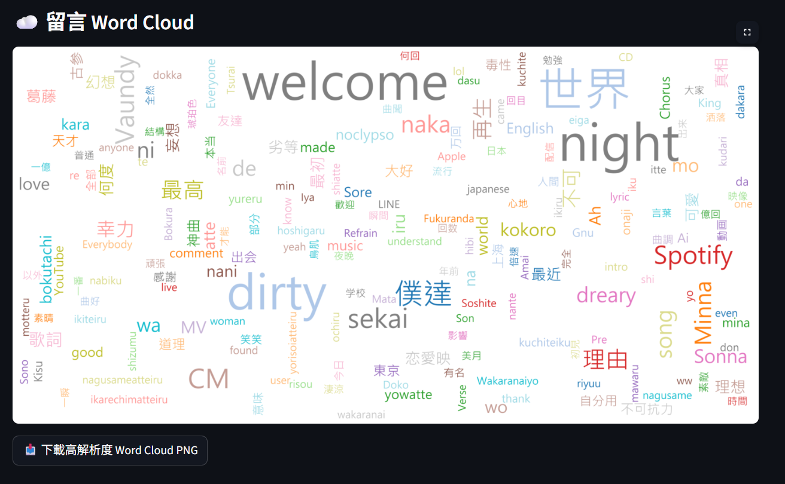
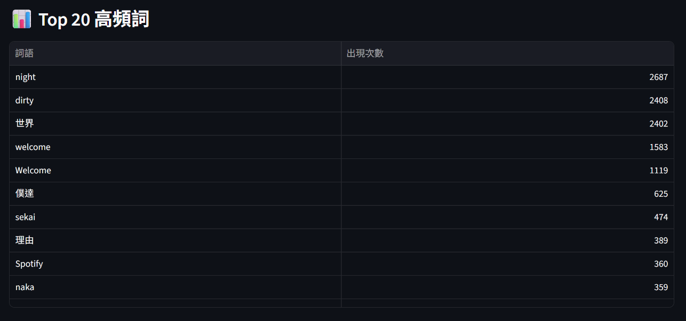

# YouTube Comment Crawler (ytcommentcrawler) 🚀


> A simple way to save your time ~

這是一個用 Python 寫的 YouTube 留言爬蟲工具，可以抓取影片留言並生成文字雲。
## 🛠 功能特色
* 自動抓取指定影片的所有留言。
* 支援文字雲（Word Cloud）生成。
* 自動過濾無效字元。

## Gallery





## 📦 安裝需求
請確保你的電腦已安裝 **Python 3.10+**，並執行以下指令安裝必要套件：

```bash
pip install -r requirements.txt
```
或手動安裝：
```bash
pip install streamlit google-api-python-client pandas wordcloud plotly matplotlib jieba
```
## 🚀 使用方法
下載或 clone 本專案。

在終端機執行：

```bash
streamlit run app.py
```
瀏覽器將自動開啟網頁介面。

在輸入框貼上 YouTube 影片網址，點擊「開始執行抓取」。

📂 檔案結構
app.py：主程式邏輯（Streamlit 網頁應用）

requirements.txt：套件依賴清單

.gitignore：忽略暫存檔與環境設定

README.md：專案說明文件

⚠️ 注意事項
本工具需要有效的 YouTube Data API v3 金鑰，請至 Google Cloud Console 申請。

字型預設使用 Windows 微軟正黑體（msjh.ttc），若在 macOS / Linux 執行，請修改 app.py 中的 FONT_PATH。

📜 授權條款
本專案採用 MIT License 授權。

***
## 與原版的主要差異

| 項目 | 原版 `cloud.py` | 新版 `app.py` |
|---|---|---|
| 執行方式 | `python cloud.py` | `streamlit run app.py` |
| 介面 | 終端機互動 | 瀏覽器網頁 |
| 安裝指令 | 4 個套件 | 7 個套件（含 Streamlit、Plotly、jieba） |
| API 需求 | 視原版而定 | 需要 YouTube Data API 金鑰 |