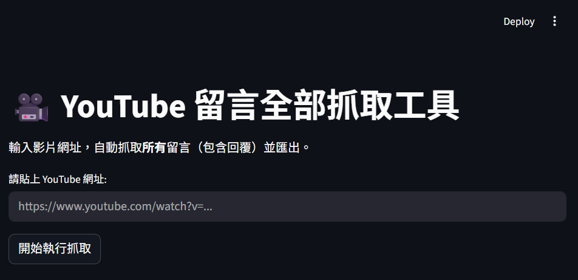
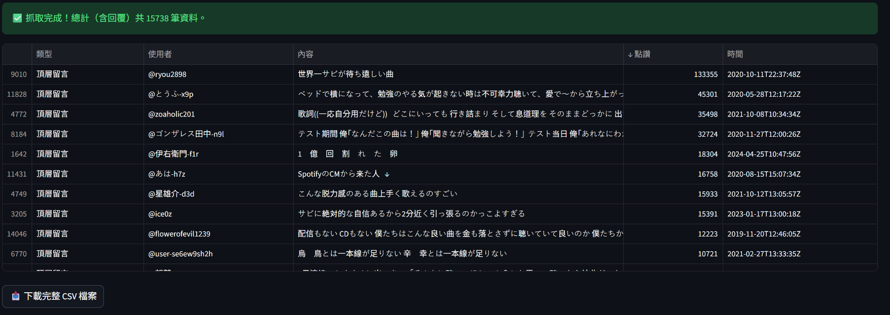
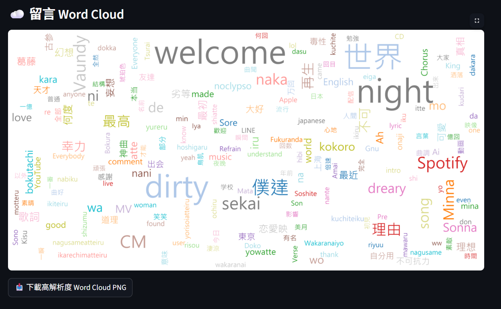
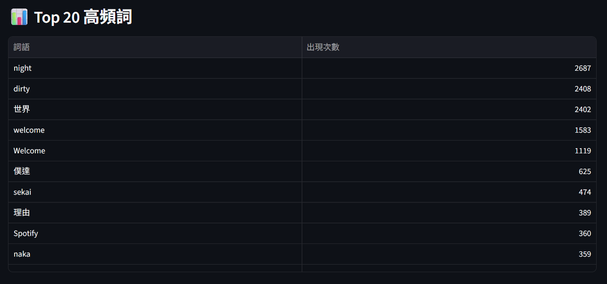

# YouTube Comment Crawler (ytcommentcrawler) 🚀


> A simple way to save your time ~

https://desktop-l8029ug.tail4cc5a3.ts.net/

這是一個用 Python 寫的 YouTube 留言爬蟲工具，可以抓取影片留言並生成文字雲。
## 🛠 功能特色
* 自動抓取指定影片的所有留言。
* 支援文字雲（Word Cloud）生成。    
* 自動過濾無效字元。

## Gallery





## 🚀 使用方法
下載或 clone 本專案。
在終端機執行：
```bash
git clone https://github.com/Gary9033/ytcommentcrawler.git
```
```bash
cd ytcommentcrawler
```
## 📦 安裝需求
請確保你的電腦已安裝 **Python 3.10+**，並執行以下指令安裝必要套件：

```bash
pip install -r requirements.txt
```
```bash
streamlit run cloud.py
```
瀏覽器將自動開啟網頁介面。

在輸入框貼上 YouTube 影片網址，點擊「開始執行抓取」。
***
📂 檔案結構
app.py：主程式邏輯（Streamlit 網頁應用）

requirements.txt：套件依賴清單

.gitignore：忽略暫存檔與環境設定

README.md：專案說明文件

⚠️ 注意事項
本工具需要有效的 YouTube Data API v3 金鑰，請至 Google Cloud Console 申請。

字型預設使用 Windows 微軟正黑體（msjh.ttc），若在 macOS / Linux 執行，請修改 app.py 中的 FONT_PATH。

📜 授權條款
本專案採用 MIT License 授權。

***
